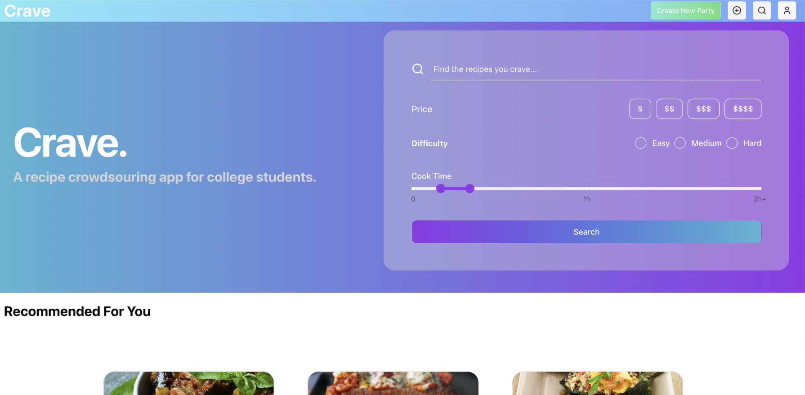

# OOSE Team Project



Crave - A recipe sharing app for college students

- [Team Information & Agreement](./docs/team-agreement.md)
- [Requirements Specification](./docs/requirements-specification.md)
- [Project Roadmap](./docs/roadmap.md)
- [Technical Documentation](./docs/technical-documentation.md)

## Installing / Getting started

### Prerequisites & Setup

Make sure you have [node](https://nodejs.org/en) and [pnpm](https://pnpm.io/) installed. Make sure they are up-to-date as older versions of node may not be supported. You may want to install [PostgreSQL](https://www.postgresql.org/) to run a local database for development.

Next, clone the repository and navigate to the `web/` folder and run `pnpm install` and `pnpm dev` to start the frontend client.

Then, navigate to the `api/` folder and run `pnpm install`

For a database, you can either use a local PostgreSQL instance, or you can create an external one with [prisma](https://console.prisma.io/cm76k5lgv04fom2dzj2ohv0rm/overview). Either way, you'll have a database URL you should save in a `.env` file.

Furthermore, you need to provide your own OpenAI API key to use our AI-powered features. If you don’t have one, you can get it from OpenAI's API key page. If you're testing the app without using AI features, you can leave OPEN_AI_KEY empty or use a placeholder value.

Within the `api/` directory, save a `.env` file with the following schema:

```env
DATABASE_URL=<YOUR_URL_HERE>
OPEN_AI_KEY=<YOUR_OPENAI_API_KEY_HERE>
```

### Setting up python

Our backend runs a python script to generate feature vectors for recipes. In order for the script to run properly, make sure you have
python version 3.10 installed. navigate to `api/scripts/` and run

```bash
pip install -r requirements.txt
```

If you have python installed in a conda environment and would rather install the requirements file inside of that environement, run 
the following command to to list your environemnts and choose the correct one:

```bash
conda env list                    # get a list of conda environements on your local machine
conda activate my_env             # activate your environment
pip install -r requirements.txt   # install the requirements
```
If you do not have conda installed and the venv virtual environemnt is not working, please download anaconda from the internet and install conda and try the conda environment method.


## Developing

Starting from the root folder, you can run these commands:

```bash
cd ./api
pnpm install
pnpm prisma generate
pnpm prisma migrate dev
pnpm run dev

cd ../web
pnpm install
pnpm run dev
```

Additionally, in the api folder, create a .env file with the following:

```DATABASE_URL=<database_api_url>```

## Seeding

WARNING: if you seed the database it will remove all current users to avoid unique email conflicts. If you don't want to get rid of the current database values don't run the seed comand.

From the api folder after setting up the development backend you can run this command to seed the database with some test data:

```bash
pnpm prisma db seed
```

There are 10 recipes to start with in the seed data. 2 categories of 5 recipies where within each category recipes are increasingly less similar.

## Testing

Normally, testing is ran automatically on any pull request to `dev` or `master`. For the time being, this functionality is restricted and testing must be done locally. 

### Backend Testing

Backend tests are run using [Vitest](https://vitest.dev/). Simply navigate to the `api/` directory and (assuming all development prerequisites are currently installed) run the following:

```bash
pnpm test
```

We also added additional tests that require a testing database so create a .env.test file in the root of the api directory. Then populate it with the same urls in the .env file but using test versions. To run tests and get a coverage score use this command:

```bash
pnpm vitest --coverage
```


Adding additional backend tests is extremely easy. Simply create a new file in the `api/src/__tests__/` directory that ends in `.test.ts` and it will automatically be detected by Vitest. At the top of the file, make sure you copy the Mock Prisma client initialization code:

```typescript
vi.mock('../../prisma/db', async () => {
  return {
    ...await vi.importActual<typeof import('../lib/__mocks__/prisma')>('../lib/__mocks__/prisma')
  };
});
```

Otherwise, tests can be written according to Vitest docs.

### Frontend & E2E Testing

Frontend & E2E tests are run using [Cypress](https://www.cypress.io/). First, both the backend and frontend servers must be running (refer back to `## Developing`). Then, simply navigate to the `web/` directory and (assuming all development prerequisites are currently installed) run the following:

```bash
pnpm test
```

Adding additional frontend & E2E tests is also easy. Navigate to the `web/cypress/e2e/` directory and create a file ending in `.cy.js`. From there, tests can be constructed according to Cypress docs. Some global Cypress helper functions are provided and documented in the `web/cypress/support/commands.ts` file.

## Deployment

To build a docker image for deployment, create a .env.production file in the root of the api folder with the same information as the .env
file in api. There, you can replace the DATABASE_URL with a production specific one. To test the health of the docker container run the following
command in the api folder or the web folder to test their respective containers:

```
docker build -t container_name .
```

When you're building this, make sure your docker desktop is running. If you want to compose both api and web containers, cd to 
the root directory of the app and cd to crave-app-development/ folder. Then run the command: 

```
docker-compose up -d
```

The working link should be hosted at https://team05.zapto.org/api for the api container and https://team05.zapto.org/web for the web container.
To deploy on the cloud, you need to connect to an existing cloud provider. We chose to use AWS free trial.

For our application:
You can access the app at <https://team05.zapto.org/>.


## Contributing

Refer to the [Contributing Guidelines](./CONTRIBUTING.md) for information on how to contribute to the project.

## Licensing

Refer to the [Project Repository License](./LICENSE.md) for information on how the project is licensed.
